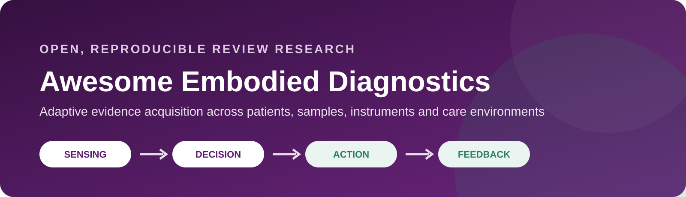
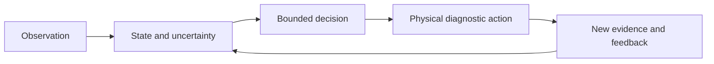

# Awesome Embodied Diagnostics



[](https://github.com/undefinted/awesome-embodied-diagnostics/actions/workflows/validate.yml)


A curated, reproducible research repository for **embodied intelligence in medical detection**: diagnostic systems in which decisions change subsequent physical observation, interaction, sampling or testing, and the resulting evidence updates later decisions.

> **Status:** private working repository. The literature map and quantitative results remain under active validation. Counts are research-workflow outputs, not claims of global coverage or clinical maturity.

## Core thesis

> Embodied intelligence extends medical detection from interpreting isolated measurements to **adaptive evidence acquisition** across patients, samples, instruments and care environments.

The basic unit is a `sensing → decision → action → feedback` loop. A system is treated as fully embodied only when an inference changes a subsequent physical measurement or diagnostic action and the consequence updates later decisions.



## Contents

- [Scope and inclusion boundary](docs/SCOPE.md)
- [Curated literature](literature/README.md)
- [Search and screening data](data/README.md)
- [Reproducible code](scripts/)
- [Generated results and figures](outputs/)
- [Review/manuscript research package](archive/imported_packages/)
- [Releases and provenance](provenance/)
- [P5–P29 page-by-page research support](docs/PRESENTATION_SLIDE_SUPPORT.md)
- [Application evidence and analysis package](docs/APPLICATION_PRESENTATION.md)
- [Public-available P5–P29 slide blueprint](docs/P5_P29_PUBLIC_AVAILABLE_SLIDE_BLUEPRINT.md)
- [Public-source counting method](docs/PUBLIC_COUNTING_METHOD.md)
- [Subscription-database and full-text acquisition backlog](docs/PUBLIC_SOURCE_LIMITATIONS_AND_ACQUISITION.md)
- [Data rigour and completeness audit](docs/DATA_RIGOUR_AND_COMPLETENESS_AUDIT_2026-08-13.md)

## Application map

| Domain | How the action creates evidence | High-priority loop |
|---|---|---|
| Active observational sensing | Changes viewpoint, contact or scan trajectory | uncertainty-driven rescan and stopping |
| Response-based interactive diagnosis | Applies a stimulus and measures response | sequential palpation or stimulation mapping |
| Sample-based interactive diagnosis | Acquires tissue or fluid | adequacy-aware resampling and stopping |
| Laboratory diagnostics | Routes samples, tests or experiments | result-driven reflex, recovery and protocol adaptation |
| Everyday monitoring | Changes confirmation or escalation after anomaly | personal-baseline detection followed by bounded confirmation |

## Featured evidence anchors

- Autonomous thyroid and carotid ultrasound provide human workflow evidence, but not randomized outcome evidence.
- Multicentre robotic phlebotomy includes analytical equivalence and a 1,633-participant routine-use cohort.
- Ferrobotic and digital-microfluidic platforms demonstrate programmable physical laboratory loops; deployment evidence remains limited.
- Large wearable cohorts show longitudinal sensing at scale, while most action loops remain human-mediated.

See [`data/presentation/application_evidence.csv`](data/presentation/application_evidence.csv) for claim-level qualifiers and sources.

## Clinical Detection and Intervention taxonomy

The current release uses a task-level, mechanism-first taxonomy. A classification row represents one evaluated diagnostic evidence-acquisition episode, not an entire robot, paper or sensing modality:

- **1.1 Active observational sensing** — feedback changes acquisition configuration and the evidence remains an in-vivo observation;
- **1.2 Response-eliciting interactive diagnosis** — a deliberate perturbation produces the response interpreted as evidence;
- **1.3 Diagnostic sample acquisition** — material is obtained for ex-vivo analysis and acquisition or adequacy participates in the evaluated loop.

Access route defines the subtask families within 1.1 and 1.3; perturbation type defines the subtask families within 1.2. Modality, anatomy, carrier and autonomy are independent tags. See the [full bilingual taxonomy and boundary rules](docs/CLINICAL_DETECTION_INTERVENTION_FINAL_TAXONOMY.md).

The former mutually exclusive paper-level count figures have been withdrawn. Their source was an automated title screen, and their task labels mixed modalities, routes and carriers at the same level. The frozen retrieval records remain in Git history and raw data snapshots for audit, but they are not presented as final review counts. New numerical claims will require uniform public-source searching, abstract/full-text eligibility screening and task-level coding under the final taxonomy.

Generate the bilingual formal taxonomy and assignment-rule figures with:

```bash
python scripts/make_clinical_detection_intervention_taxonomy_figures.py \
  --taxonomy data/presentation/clinical_detection_intervention_final_taxonomy.csv \
  --output-dir figures/clinical_detection_intervention_final
```

## Presentation support

- P5–P29 slide-by-slide communication job, layout and evidence: [`docs/P5_P29_PUBLIC_AVAILABLE_SLIDE_BLUEPRINT.md`](docs/P5_P29_PUBLIC_AVAILABLE_SLIDE_BLUEPRINT.md)
- Corrected P5 task-level taxonomy, counts, limitations and validation: [`docs/P5_RECLASSIFIED_PUBLIC_LANDSCAPE_2026-08-14.md`](docs/P5_RECLASSIFIED_PUBLIC_LANDSCAPE_2026-08-14.md)
- P5 reclassified audit workbook: [`outputs/p5_reclassification/p5_active_observation_reclassified_2026-08-14.xlsx`](outputs/p5_reclassification/p5_active_observation_reclassified_2026-08-14.xlsx)
- Audit-ready workbook with task counts, maturity, verified studies and all screened records: [`outputs/public_landscape/public_available_presentation_evidence.xlsx`](outputs/public_landscape/public_available_presentation_evidence.xlsx)
- Editable SVG and high-resolution PNG figures: [`figures/public_evidence/`](figures/public_evidence/)
- Every current chart has a fully translated English sibling (`*_en.svg` and `*_en.png`); policy and validation: [`docs/BILINGUAL_FIGURE_POLICY.md`](docs/BILINGUAL_FIGURE_POLICY.md)
- Template-following layout example for P9 and P13: [`presentations/医学检测具身智能_P9_P13公开证据排版示例.pptx`](presentations/医学检测具身智能_P9_P13公开证据排版示例.pptx)

## Final working taxonomy

| Evidence-generation mechanism | Diagnostic action | Typical tasks |
|---|---|---|
| Active observational sensing | Repositions or controls a sensor to acquire a new in-vivo observation | external contact/non-contact scanning, tethered or untethered internal observation, catheter sensing |
| Response-eliciting interactive diagnosis | Applies a controlled perturbation and interprets the elicited response | palpation, dynamic excitation, provocation, stimulation-response mapping |
| Diagnostic sample acquisition | Acquires diagnostic material for ex-vivo analysis | needle tissue sampling, blood draw, endoluminal/capsule sampling, mucosal collection |

The underlying system can be multi-stage. Distinct evaluated episodes remain linked rather than forcing the whole platform into one class. Static classification, report generation, targeting-only studies and fixed trajectories without feedback are not treated as complete embodied diagnostic loops.

## Reproduce

```bash
python -m venv .venv
# Windows: .venv\Scripts\activate
# Linux/macOS: source .venv/bin/activate
pip install -r requirements.txt
python scripts/validate_repository.py
python scripts/analyze_application_landscape.py
```

Existing analysis scripts and exact data snapshots are preserved. Networked retrieval will change as bibliographic indexes update; freeze the query date and retain raw responses when refreshing results.

## Contributing

See [CONTRIBUTING.md](CONTRIBUTING.md). New papers should include a stable DOI, PubMed/Europe PMC, arXiv or publisher identifier; an evidence-generation label; evidence stage; and a concise statement of whether a physical feedback loop is actually demonstrated.

## Copyright and release policy

Bibliographic metadata, original curation and code can be prepared for open release after licence review. Publisher PDFs and other third-party full texts are kept in `local_only/`, ignored by Git, and must not be redistributed without permission. The repository is private while provenance, author attribution and reuse terms are being reviewed.
